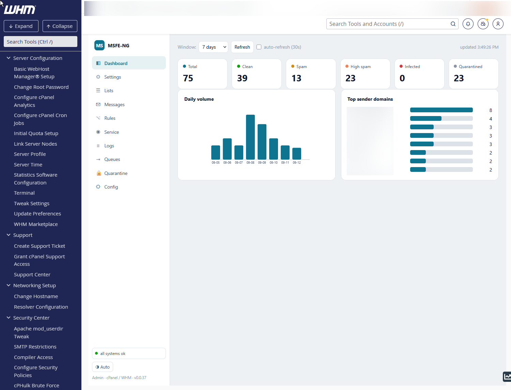
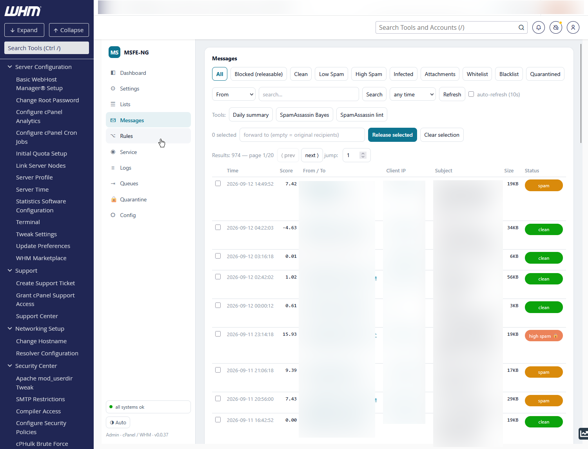
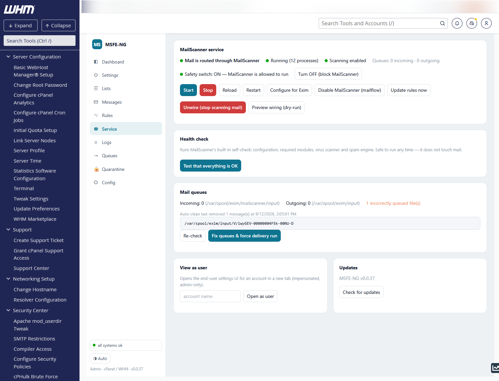
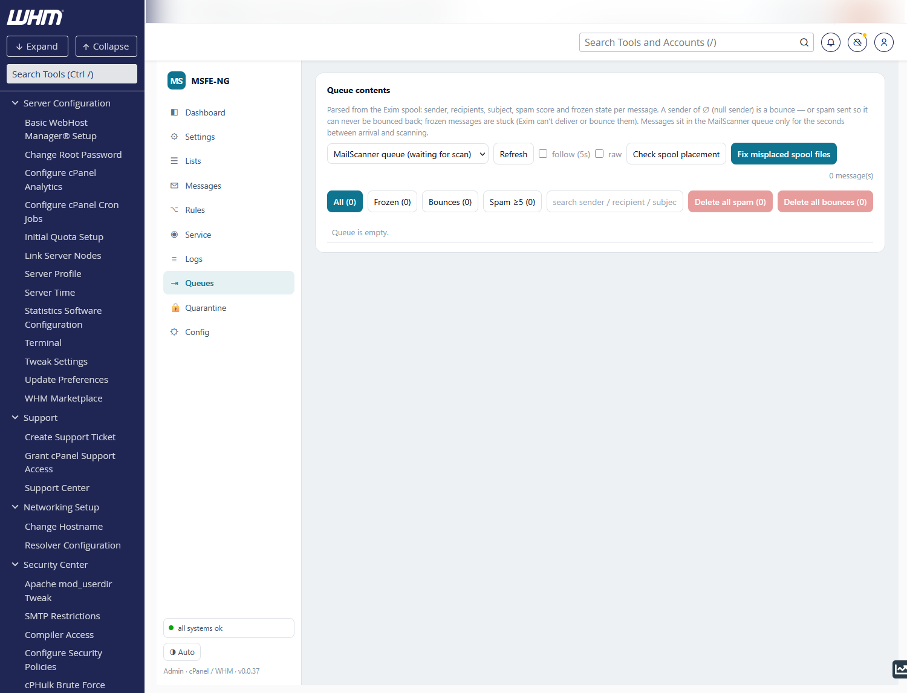
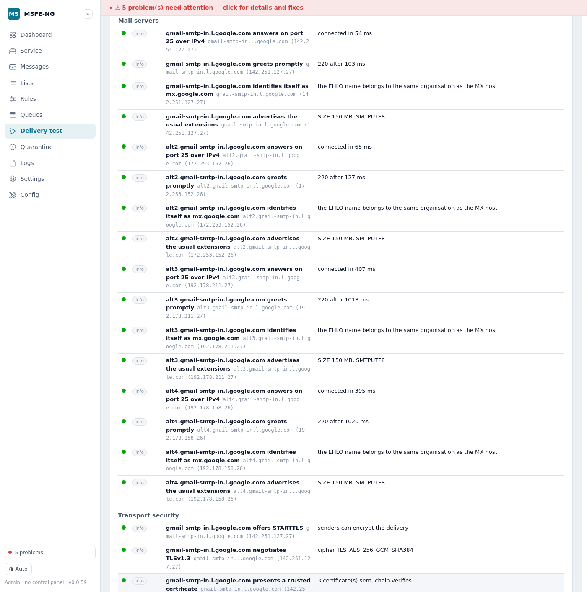
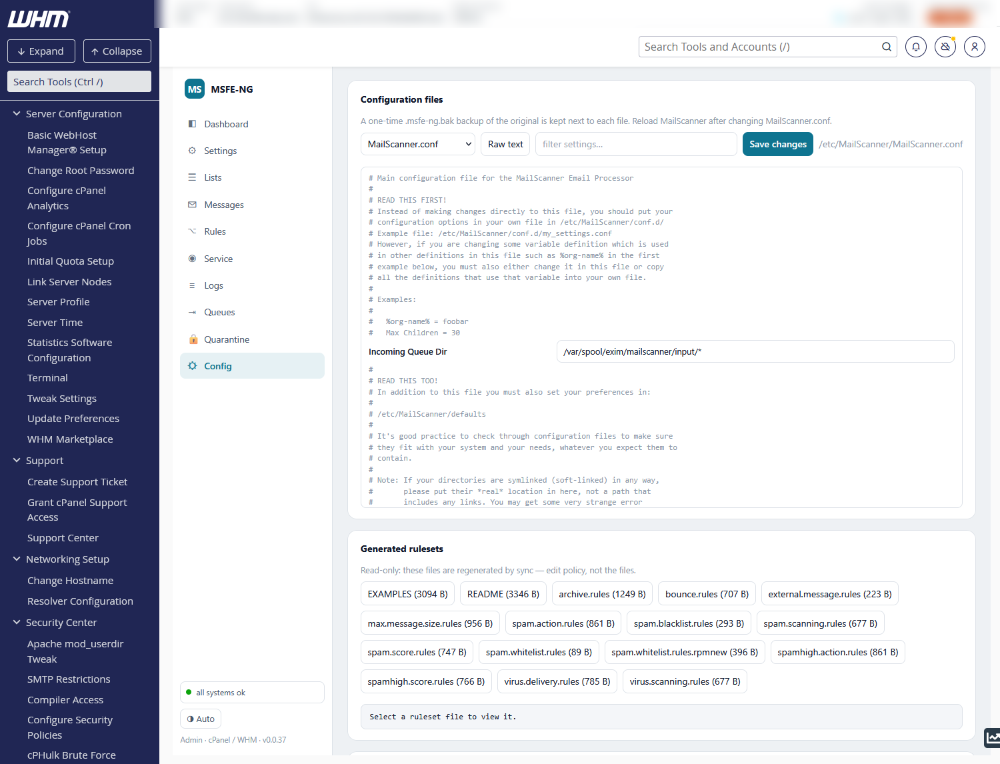

# MSFE-NG — MailScanner Front-End (Next Generation)

A modern, open-source (GPLv3) front-end for **MailScanner** on **cPanel/WHM** and
**DirectAdmin**. It gives administrators and end-users a clean UI to manage spam
and virus filtering — global and per-domain policy, black/white lists, SpamBox,
quarantine review and release, message archive, queue management, and digests —
backed by a small Rust daemon.

MSFE-NG is a **clean-room replacement** for the discontinued, proprietary
ConfigServer MailScanner Front-End (MSFE). It reads MSFE's old config files so
you can migrate, but ships **no licensing, no phone-home, and no obfuscation** —
just maintainable, auditable code.

> **Status: v1.0 — in production.** Runs on a live cPanel/Exim server:
> installs (optionally including MailScanner itself), wires Exim to the scanner,
> logs and archives every message to MySQL, edits and tests every MailScanner
> configuration file, manages the queues, diagnoses deliverability for any
> address, and alerts via Telegram. Releases are tagged continuously
> (`1.0.<build>`); upgrade in place with the same one-liner as the install or
> from the UI.

## Install

One line, as root on a cPanel/WHM or DirectAdmin server — it downloads the
latest release, verifies it and installs (or upgrades in place):

```sh
curl -fsSL https://raw.githubusercontent.com/inalto/msfe-ng/main/packaging/get.sh | sh
```

See [Quick start](#quick-start-as-root-on-a-cpanel-or-directadmin-server) for
installing MailScanner along with it and for the first-time setup commands.

## Screenshots

| Dashboard | Messages |
|---|---|
|  |  |

| Service | Queues |
|---|---|
|  |  |

| Delivery test | Config |
|---|---|
|  |  |

More in the **[usage wiki](https://github.com/inalto/msfe-ng/wiki)** — one page
per tab of the admin UI, plus the end-user panel, CLI and troubleshooting.

## Features

- **WHM/DA admin UI** — reporting dashboard (traffic, top senders, categories,
  client IPs with geolocation and one-click CSF block), global spam/virus
  policy, per-domain overrides, system white/black lists, and a live health
  banner with one-click fixes. Light/dark theme.
- **Configuration editor & tester** — every file under `/etc/MailScanner`
  (and MSFE-NG's own `config.toml`) edited with structured forms or raw text;
  each save is validated on a staged copy (MailScanner `--lint` + cross-file
  checks), backed up, applied and reloaded, and rolled back if the scanner
  refuses it. A tester runs the checks on pending edits and simulates what
  the chain does with a clean/GTUBE/EICAR or uploaded message. Whole-tree
  **snapshots** export and import between servers (`msfe-ng conf test`,
  `msfe-ng snapshot`).
- **End-user UI** — per-domain spam/virus preferences, personal white/black
  lists, and a quarantine browser (view + release), scoped to the account's own
  domains.
- **Message log & archive** — a clean `MailScanner::CustomConfig` plugin logs
  every message to MySQL (MailWatch-schema compatible); optional full-message
  archive gives you the complete content of *every* message, not just
  quarantined mail, with per-domain opt-out and retention windows.
- **Quarantine & release** — release as resend, forward, or direct-to-inbox
  (Dovecot LDA); SpamAssassin learn on reclassify; SpamCop reporting; daily
  quarantine digests.
- **Engine management** — install MailScanner from the UI or CLI, point it at
  Exim (`engine configure`), and wire mail flow through an **Exim named queue**
  (`engine wire`) — no second Exim config, instantly reversible.
- **Queue management** — both queues parsed straight from the Exim spool
  (sender, recipients, subject, spam score, frozen state), multi-select bulk
  delete/deliver, one-click delete-all-spam/bounces, and configurable
  **auto-clean rules** (frozen/bounce age, spam score) for the delivery queue.
- **Monitoring & alerts** — a 5-minute monitor cron applies the auto-clean
  rules and sends **Telegram alerts**: queue growth, stuck scanning queue, and
  per-account outbound sending bursts (compromised-account detection).
- **Auto-ban** — temporary csf bans for spam sources per severity threshold
  (count in a window, ban duration), and **match rules** by subject, sender,
  header or body that block delivery and ban the source — created from the
  Config tab or straight from a message row; safeguards keep shared provider
  IPs out of the firewall.
- **Delivery test** — a deliverability diagnostic for any address: DNS,
  DNSSEC and name-server agreement, SPF/DKIM/DMARC, the MX hosts and their
  TLS, MTA-STS/TLS-RPT/DANE/BIMI, blocklists — pass/warning/fail/unknown
  with evidence and the exact record, WHM location or command that fixes it
  (`msfe-ng delivery test user@example.com`). For addresses hosted here a
  read-only **cPanel audit** (account, routing, outbound identity, services,
  limits, logs, queues, abuse signals); plus a saved message or bounce taken
  apart, a **diagnostic inbox** (one-time addresses that report how a message
  arrives), a real **test message** followed through Exim's log, and
  **monitors** that re-test on a schedule and alert on regressions.
- **Account DNS** — the same tab's second view answers the server-wide
  question: one scan over **every domain of every account** reporting SPF,
  DKIM and DMARC, with cPanel's own validators behind the SPF and DKIM
  verdicts, subdomain noise hidden by default, and **Repair** running cPanel's
  installers (`install_spf_records`, `ensure_dkim_keys_exist` + `enable_dkim`,
  `addzonerecord`) — nothing hand-edited. Domains whose DNS is hosted
  elsewhere get the exact record to publish, with a copy button
  (`msfe-ng acctdns scan`).
- **Doctor** — `msfe-ng doctor` checks every link of the scanning chain (engine,
  wiring, queue flow, spool placement, quarantine writability, DB, logging,
  DNS blocklists, Telegram) and pairs each finding with the exact command that
  fixes it; `--fix` (or the banner button) applies the mechanical ones.
- **Private DNS resolver** — one click installs unbound on loopback so
  Spamhaus, URIBL and DNSWL answer instead of refusing the hosting provider's
  shared resolvers (`msfe-ng resolver install`).
- **Upgrades & migration from the UI** — upgrade MSFE-NG or the MailScanner
  RPM as a background job that survives the daemon restart; guided,
  step-by-step migration from a ConfigServer `/usr/mailscanner` engine.
- **Ops** — one-command install/uninstall/in-place upgrade, DB backup/repair,
  Bayes repair/rebuild, config backup/restore, spool repair, self-test
  (GTUBE/EICAR/clean), scanning on/off toggle, and migration from the original
  MSFE via `msfe-ng import /usr/msfe --save`.

## Quick start (as root on a cPanel or DirectAdmin server)

```sh
# bootstrap: download + verify the latest release, then install (see Install above)
curl -fsSL https://raw.githubusercontent.com/inalto/msfe-ng/main/packaging/get.sh | sh

# no MailScanner yet? let the installer set it up too:
curl -fsSL https://raw.githubusercontent.com/inalto/msfe-ng/main/packaging/get.sh | MSFE_NG_WITH_ENGINE=1 sh

# …or from a checkout:
git clone https://github.com/inalto/msfe-ng && cd msfe-ng
cargo build --release --workspace       # or: packaging/dist.sh to build a tarball
sudo packaging/install.sh               # re-run any time to upgrade in place
```

Then set the database credentials in `/etc/msfe-ng/config.toml` and run:

```sh
msfe-ng db-migrate                 # create the schema
msfe-ng mailscanner enable-logging # hook logging into MailScanner (restart it after)
msfe-ng sync                       # generate the rules
msfe-ng engine wire                # route incoming mail through MailScanner
msfe-ng doctor                     # verify the whole chain, with fixes per finding
```

Open **WHM → Plugins → MSFE-NG** (or **DirectAdmin → MSFE-NG**). Check the daemon
any time with `msfe-ng health`.

Full documentation: **[Usage wiki](https://github.com/inalto/msfe-ng/wiki)** ·
**[Delivery test](https://github.com/inalto/msfe-ng/wiki/Delivery-test)** ·
**[Account DNS](https://github.com/inalto/msfe-ng/wiki/Account-DNS)** ·
**[Admin guide](docs/admin-guide.md)** ·
**[User guide](docs/user-guide.md)** · **[Migration guide](docs/migration.md)** ·
**[Architecture](docs/architecture.md)**.

## Architecture

A **Rust core** does the work; a **thin Perl layer** exists only where cPanel and
MailScanner insist on loading code by package name. Everything talks to the daemon
over a local Unix socket.

```
Browser ─► panel shim (WHM CGI · cPanel UAPI/live-CGI · DA CGI)
                │  forwards method + body + authenticated user
                ▼
          msfe-ngd (Rust daemon, root)  ── Unix socket /var/run/msfe-ng/msfe-ng.sock
                │
                ├─ rule engine  → MailScanner rule files
                ├─ engine wiring → Exim named queue "mailscanner" → MailScanner → delivery
                ├─ reporting/policy API → MySQL (maillog + bodies, quarantine, config)
                ├─ queue view/actions → Exim spool (-H files parsed directly)
                ├─ config editor/tester → /etc/MailScanner (staged, linted, backed up)
                ├─ delivery test → DNS/SMTP/TLS probes (own resolver client, openssl, curl)
                └─ digests · housekeeping · monitor (auto-clean, delivery monitors, Telegram) · doctor
```

The socket is world-connectable; the daemon authenticates every connection by
its kernel peer credentials (`SO_PEERCRED`): root callers (the WHM/DA admin
shims, the CLI) get the admin surface and may vouch for a panel user via
`X-MSFE-User`; any other uid — the cPanel LiveAPI CGI and DirectAdmin user
plugins run as the account — gets only the end-user page and `/api/user/*`,
scoped to the account that uid belongs to, whatever headers it sends.

- `crates/msfe-ngd` — daemon: serves the UI + JSON API.
- `crates/msfe-cli` — `msfe-ng` CLI (install/cron/hooks and admin use).
- `crates/msfe-core` — rule engine, engine wiring, queue view, monitor, doctor,
  config editor/tester/snapshots, delivery test (DNS client, SPF/DKIM/DMARC,
  SMTP/TLS probes, cPanel audit, log correlation), DB, stats, panel abstraction.
- `crates/msfe-api` — shared types/constants.
- `panel/` — cPanel + DirectAdmin integration files and Perl shims (incl. the
  MailScanner logging plugin).
- `web/` — the admin and user single-page apps (precompiled Tailwind, served
  inline by the daemon).
- `db/` — SQL migrations. `packaging/` — installer, service, cron, release tools.

The Rust workspace is intentionally **dependency-free** (std only), so it builds
fully offline; MySQL is reached through the system `mysql` client, Telegram
through `curl`, DNS through a hand-rolled client (plus `delv`/`unbound-host`,
`openssl` and `curl` for the delivery test). Installed cron jobs: rule sync
every 10 min (reloads MailScanner only when the ruleset actually changed), queue
monitor every 5 min (auto-clean, alerts, scheduled delivery tests), digests and
housekeeping daily.

## CLI at a glance

```
msfe-ng health | panel | config | doctor
msfe-ng import <dir> [--save]        # migrate legacy MSFE config
msfe-ng sync [--dry-run]             # policy → MailScanner rules
msfe-ng engine <status|install|configure|enable|disable|lint|wire|unwire>
msfe-ng service <status|start|stop|reload|restart|queue-fix|spool-repair>
msfe-ng monitor [--dry-run]          # auto-clean rules + Telegram alerts
msfe-ng rules <lint|adopt [--from <dir>]>
msfe-ng db-migrate [--status]
msfe-ng db <backup|fix|bayes-repair|bayes-recreate>
msfe-ng mailscanner <status|enable-logging|disable-logging>
msfe-ng spambox <enable|disable|status>
msfe-ng digest [--dry-run] | housekeeping | selftest
msfe-ng exim <status|enable-scanning|disable-scanning|enable-cpanel-spamassassin|disable-cpanel-spamassassin>
msfe-ng upgrade [--check]
msfe-ng doctor [--fix]
msfe-ng resolver <status|install>
msfe-ng conf <test [--with <id>=<file>] | test-message <sample|file.eml>>
msfe-ng snapshot <export [file] | import <file> [--dry-run] | list>
msfe-ng backup <file.tgz> | restore <file.tgz>   # aliases of snapshot export/import --only msfe
msfe-ng delivery test <address> [--ip <ip>] [--selector <s>] [--audit] [--json|--html]
msfe-ng delivery eml <file.eml> [--bounce]       # a saved message or bounce taken apart
msfe-ng delivery inbox <install|uninstall|status|new|poll <token>>
msfe-ng delivery testmail --from <hosted> --to <address>
msfe-ng delivery monitor <list|add <address>|remove <id>|run>
```

## Testing status

The Rust core is unit-tested (`cargo test --workspace`) and CI enforces
rustfmt, clippy `-D warnings`, shellcheck, `perl -c`, and a reproducible web
build. MSFE-NG runs in production on a live cPanel/Exim/MailScanner host;
integration test results from other cPanel/DA environments are welcome.

## Contributing

MSFE-NG is a clean-room project — please read the **[clean-room policy](CONTRIBUTING.md)**
before contributing. In short: never copy original MSFE code; read it only to
understand behavior, then write fresh code.

```sh
cargo build --workspace && cargo test --workspace
cargo clippy --workspace --all-targets -- -D warnings
cargo fmt --all
shellcheck packaging/*.sh          # perl -c on the panel/*.pm|*.cgi shims
```

## License & attribution

Copyright © 2026 **Martini Multimedia s.a.s.** — Alain Martini.
Licensed under the **GNU General Public License v3.0 or later** — see [LICENSE](LICENSE).

MSFE-NG is an independent, clean-room reimplementation. It is **not** affiliated
with, endorsed by, or derived from ConfigServer / Way to the Web, and contains
none of their code. "MailScanner", "cPanel", and "DirectAdmin" are trademarks of
their respective owners.
